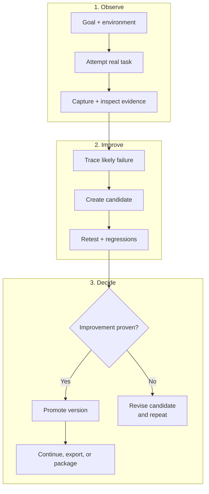

# EvoRig

EvoRig is an agent-first framework for building and improving task-specific AI agent harnesses through evidence-backed trial and error.

The agent first tries its best to produce the desired result in the real environment. EvoRig records the attempt and its evidence: generated artifacts, visual outputs, files, logs, traces, structured state, and other signals that help explain what happened. The agent inspects the result, compares it with the intended outcome, and follows the recorded evidence back through the run to identify where a likely mistake was introduced.

The agent can then propose a candidate change to its instructions, context, tools, retrieval, validators, or environment and test the task again. The active harness does not change merely because a candidate was created. EvoRig promotes the candidate only after the new evidence supports an improvement and the change passes the unit's relevant checks.

Each task-specific development environment is called a **harness unit**. A harness unit keeps the goal, environment map, harness material, experiments, evidence, regression cases, and restorable versions together in a portable directory. It is designed to be paused, moved, continued by another compatible agent or machine, and exported into the environment where the improved harness will be used.

EvoRig is optimized for setup and operation by AI agents. Give a capable agent the repository link and describe what you want the harness to improve. The agent can install EvoRig, onboard itself, inspect or build the testing environment, and create the first harness unit. It may ask a few questions when important context or permission is missing. A guided manual setup and full CLI are also available.

> EvoRig is not another agent runtime or evaluation dashboard. It is the artifact-aware development and versioning layer an agent uses to build a better harness without replacing the working version before an improvement is proven.

**Project status:** [v0.0.1 private alpha](https://github.com/Ker102/EvoRig/releases/tag/v0.0.1). The core lifecycle works, but commands and file formats may still change before the first public release.

## Start Here

- **Using EvoRig through an agent:** [Agent Quick Start](#agent-quick-start)
- **Installing it yourself:** [Install And Start](#install-and-start)
- **Understanding harness units:** [What Is A Harness Unit?](#what-is-a-harness-unit)
- **Understanding the loop:** [The Lifecycle, Made Simple](#the-lifecycle-made-simple)
- **Connecting a real environment:** [Environment Setup](#environment-setup)
- **Changing defaults:** [Configuration](#configuration)
- **Technical architecture:** [Core lifecycle](docs/architecture/core-lifecycle.md), [runtime layers](docs/architecture/runtime-layers.md), and [concurrency](docs/architecture/concurrency.md)
- **Full agent instructions:** [Agent onboarding](docs/agent-onboarding.md)
- **Visual process:** [How EvoRig works](docs/framework-process.md)

## Why EvoRig Exists

Models often repeat the same failures because the useful lessons from one attempt never become a tested part of their working environment. Adding a larger prompt or collecting an evaluation score does not solve the whole problem.

The model is only one part of an agent's performance. The harness around it determines what context it sees, which tools it can use, how it interacts with the environment, what it remembers, how results are inspected, and whether mistakes become durable improvements. For many task-specific problems, this makes the harness the highest-leverage improvement surface available: it can produce significant gains without retraining the model, and every change remains inspectable, testable, reversible, and portable.

EvoRig makes that work structured and efficient. Instead of accumulating one-off prompt edits, it lets an agent develop multiple independent harness units, test changes through real attempts, preserve evidence and history, and continue or export each successful harness as a coherent package.

EvoRig gives the operating agent a controlled improvement loop:

- work on the real task rather than only a synthetic benchmark;
- capture renders, screenshots, files, traces, logs, structured state, or other artifacts;
- inspect those artifacts visually, structurally, or behaviorally;
- trace weak results back to instructions, tools, context, retrieval, environment, or model limits;
- develop improvements as isolated candidate patches;
- test candidates against new attempts and regression cases;
- promote only changes supported by valid evidence;
- preserve restorable versions and package the resulting harness for reuse.

The agent is free to reason and experiment inside the harness workspace. EvoRig controls the integrity-sensitive boundaries: records, protected state, evidence, promotion, snapshots, rollback, and packaging.

### Why Improve The Harness Before The Weights?

Research across agent interfaces, retrieval, tools, and iterative feedback shows that changing the system around a model can substantially improve task performance without changing the model's weights. EvoRig grew from practical problems encountered while building agent harnesses; the following work independently supports its harness-first direction:

- [Self-Harness](https://arxiv.org/abs/2606.09498) found that agents could mine weaknesses from execution traces, propose harness changes, validate them with regression tests, and improve held-out pass rates across three model families.
- [SWE-agent](https://arxiv.org/abs/2405.15793) showed that a purpose-built agent-computer interface substantially improved how language models navigated repositories, edited code, and executed tests.
- [Reflexion](https://arxiv.org/abs/2303.11366) improved agents through trial-and-error, linguistic feedback, and episodic memory rather than weight updates.
- [Self-Refine](https://arxiv.org/abs/2303.17651) reported an average absolute improvement of roughly 20 percentage points across seven evaluated tasks using iterative feedback and refinement without additional training.
- [Fine-Tuning or Retrieval?](https://aclanthology.org/2024.emnlp-main.15/) found that RAG consistently outperformed unsupervised fine-tuning on the knowledge-injection tasks it evaluated, including both existing and new knowledge.
- [Does Fine-Tuning LLMs on New Knowledge Encourage Hallucinations?](https://arxiv.org/abs/2405.05904) found that models struggled to acquire new factual knowledge through supervised fine-tuning and became more likely to hallucinate as that new knowledge was learned.

These results do not establish that a harness will always outperform every possible fine-tuning method. Fine-tuning can still be valuable for behavior, style, latency, specialized representations, or capabilities that cannot be supplied effectively at inference time. EvoRig's position is practical: **optimize the harness first, measure the result, and modify model weights only when evidence shows that the harness has reached its useful limit.** A strong harness and a well-chosen fine-tune can also complement each other.

## What Is A Harness Unit?

A **harness unit** is a portable workspace for improving one task family. Each unit develops independently and keeps its own target definition, environment map, harness material, experiments, evidence, regression cases, and promoted versions.

A new unit begins with this structure:

```text
my-harness-unit/
  unit.yaml                 identity and current version
  UNIT_AGENT.md             instructions for agents entering the unit
  operational-map.md        current understanding of tools, artifacts, and workflow
  target/                   task goal and suggested first tests
  environment/              contract for commands, MCP tools, apps, and artifact paths
  agent-facing/             promoted instructions and context
  tools/                    unit-specific helper tools
  observers/                ways to inspect outputs
  validators/               deterministic or agent-driven checks
  regression-cases/         failures that future candidates should not repeat
  candidates/               isolated proposed harness changes
  runtime/                  local runs and captured artifacts
  versions/                 restorable promoted snapshots
  provenance/               human-readable change history
```

This is not a restrictive template. Agents can add research, scripts, retrieval data, infrastructure declarations, memory, custom observers, or entirely new folders. The framework protects only the files and lifecycle rules needed to keep the unit understandable and recoverable.

### Portable Unit Versus Local Working Data

The reusable harness material belongs in the portable unit. Raw traces, temporary experiments, caches, secrets, unpromoted candidates, and every historical render do not.

The default `thin` package contains the promoted knowledge and contracts needed to rebuild or integrate the harness. Runtime evidence remains local unless a future package profile explicitly includes it.

## The Lifecycle, Made Simple

1. **Describe the goal.** The user explains what the agent should become better at.
2. **Map the environment.** The operating agent discovers how the real task is performed and where useful evidence comes from.
3. **Run a baseline.** The agent attempts the task before changing the harness.
4. **Inspect the result.** It examines real artifacts and records concrete findings.
5. **Create a candidate.** Instructions, tools, retrieval, validators, examples, or infrastructure are changed in an isolated workspace.
6. **Test the candidate.** The agent runs relevant and regression tasks and attaches evidence.
7. **Promote, revise, wait, or stop.** Supported improvements become a version. Weak candidates are revised or rejected. Delayed evidence and model limits are recorded rather than hidden.
8. **Export or package.** The promoted harness can be applied to a coding agent, application agent, or another compatible environment.

Finished runs are immutable. Candidate evidence is checked when attached and checked again at promotion, so deleted runs, missing artifacts, or missing evidence files cannot support a release.



See the [detailed process diagram](docs/framework-process.md) for capability gaps, human input, waiting, stopping, and the complete artifact-aware loop. A standalone copy of this smaller graph is available in [the compact lifecycle document](docs/framework-process-compact.md).

## What Makes It Different?

### Artifact-aware

EvoRig treats the produced thing as evidence. The agent can inspect an image, scene, UI, document, generated repository, runtime trace, database state, or any other useful output instead of trusting its own textual report.

### Harness-building, not only scoring

The purpose is not merely to report that an agent failed. The operating agent diagnoses the failure and develops a concrete harness change that may include prompts, principles, examples, retrieval, tools, observers, validators, regression cases, or environment automation.

### Evidence-gated self-improvement

The active agent cannot freely rewrite the promoted harness. It creates a candidate, tests it, attaches evidence, and promotes it through the framework. Every promoted version can be inspected and restored.

### Environment-agnostic

The core does not depend on Blender, SVGs, Python agents, or a specific model provider. A unit can use terminal commands, MCP servers, browser automation, desktop apps, APIs, manual steps, or a custom tool interface.

### Reasoning remains open-ended

EvoRig structures the lifecycle without turning the operating agent into a fixed script. The agent still chooses the appropriate tests, artifacts, evaluation strategy, tools, and stopping point for the task.

## Agent Quick Start

EvoRig is designed to be used primarily by talking to an agent with filesystem and terminal access.

Give the agent the repository and a prompt like this:

```text
Read this repository's README.md and docs/agent-onboarding.md.
Use EvoRig to create a harness unit that improves an agent at: [describe the task].

Inspect my existing environment before deciding how to test it. Ask only for context
that is genuinely missing. Run a baseline, capture and inspect real artifacts when
they provide useful evidence, and develop improvements through EvoRig candidates.
Do not promote a candidate without evidence.
```

The agent should then:

1. Install the local package if needed and run `evorig doctor`.
2. Read `evorig onboard --format json` or [the onboarding guide](docs/agent-onboarding.md).
3. Ask the minimum setup questions.
4. Create or continue a harness unit.
5. Inspect the actual workspace, tools, and testing environment.
6. Update `operational-map.md` with its current understanding.
7. Connect the environment and perform a baseline before proposing improvements.

### Instructions For Agents Reading This Repository

If you are the operating agent:

- Do not assume every task has a test command.
- Do not assume EvoRig discovers endpoints, tools, screenshots, or artifact paths for you.
- Read `UNIT_AGENT.md`, `operational-map.md`, `CURRENT_STATE.md`, and `NEXT_ACTION.md` when entering a unit.
- Inspect the real environment and map it into `target/` and `environment/`.
- Prefer real artifact inspection when deterministic checks cannot establish quality.
- Separate your own capabilities from tools being designed for the target agent.
- Put proposed harness changes in a candidate workspace.
- Use EvoRig commands for runs, artifacts, evidence, promotion, rollback, wait, stop, and resume.
- Ask before adding credentials, paid services, external access, security-sensitive tools, or expensive infrastructure.
- Update the operational map when assumptions, artifact paths, tools, or automation change.

Machine-readable onboarding is available through:

```bash
evorig onboard --format json
```

## Install And Start

EvoRig currently installs from the repository.

### Windows PowerShell

```powershell
git clone https://github.com/Ker102/EvoRig.git
cd EvoRig
python -m venv .venv
.\.venv\Scripts\python -m pip install -e .
.\.venv\Scripts\evorig doctor
.\.venv\Scripts\evorig setup
```

### macOS Or Linux

```bash
git clone https://github.com/Ker102/EvoRig.git
cd EvoRig
python3 -m venv .venv
./.venv/bin/python -m pip install -e .
./.venv/bin/evorig doctor
./.venv/bin/evorig setup
```

`evorig setup` opens the guided human-facing CLI. Running `evorig` without a command opens the broader interactive menu in a terminal. Agents can use the explicit non-interactive commands directly.

Useful first commands:

```bash
evorig onboard
evorig template list
evorig units list
evorig settings show
```

## What The Agent Asks You

New-unit onboarding is intentionally short. The agent should collect five pieces of context:

1. What should this harness help an agent become better at?
2. Where will the harness be used?
3. Should you define success, should the agent propose it, or should it be decided after a baseline?
4. Should validation prioritize quality, visual evidence, balance, or resource efficiency?
5. Does a testing environment already exist, partly exist, or need to be built?

You do not need to know the perfect tests or artifacts in advance. When appropriate, the agent should propose them after inspecting the task and environment. It may ask about constraints, protected areas, cost limits, or human review only when those details matter.

## Environment Setup

EvoRig records an environment mapping; the operating agent creates that mapping.

The CLI cannot magically know which MCP tool controls an application, where a render is saved, how a browser flow is reset, or what database state proves success. The agent must inspect the real workspace and connect those details to the harness unit.

Three setup modes are supported:

| Mode | Use it when | Agent behavior |
|---|---|---|
| `existing` | The task environment already works | Connect and document it; do not rebuild it without reason |
| `assisted` | Some pieces exist | Identify and add the smallest missing setup needed for a baseline |
| `managed` | The environment must be created | Build it explicitly and document infrastructure changes |

An environment can be command-driven, MCP-driven, manual, or fully custom. For example, a Blender harness may use an existing MCP server with no single run command. The agent can call tools, render the scene, capture screenshots and structured scene state, then attach those outputs to an EvoRig run.

Read [environment onboarding](docs/environment-onboarding.md) for detailed examples.

## Configuration

Most users should begin with the defaults. The first useful configuration is usually inside the harness unit, not in global settings.

### Harness-unit Configuration

| File or area | Change it when |
|---|---|
| `operational-map.md` | Tools, artifact locations, assumptions, constraints, or the workflow changes |
| `target/brief.yaml` | The task family, success definition, expected artifacts, or known risks change |
| `environment/contract.yaml` | Commands, MCP tools, setup mode, interaction mode, or output paths change |
| `agent-facing/` | A tested candidate promotes new instructions or reusable context |
| `observers/` and `validators/` | The unit needs better artifact inspection or deterministic checks |
| `regression-cases/` | A discovered failure should be tested in future iterations |
| `tools/` and `infrastructure/` | Better performance requires unit-specific capabilities or services |

Do not manually edit framework-owned `.evolve/`, `versions/`, `provenance/`, `runtime/`, or candidate metadata. Use the CLI lifecycle commands.

### Global Preferences

View preferences with `evorig settings show` and change one with:

```bash
evorig settings set validation.prefer_visual_artifacts true
evorig settings set agent_behavior.autonomy_level balanced
evorig settings set runtime.token_efficiency_mode false
```

Important preference groups are:

- `agent_behavior`: autonomy, risky-action confirmation, and promotion strictness;
- `validation`: agent-decided validation, visual-artifact preference, and resource mode;
- `export`: default target adapter and package profile;
- `runtime`: telemetry detail, token-efficiency mode, and local unit registry behavior.

In the alpha, preferences are durable defaults and guidance for the CLI and operating agent. Not every preference is enforced automatically by every engine command yet. Evidence-required promotion is enforced unless the explicit development override is used.

## Example Use Cases

- Improve spatial reasoning and scene construction for a Blender or CAD agent.
- Improve SVG, image, slide, document, or UI generation through rendered artifact review.
- Build a coding-agent harness for a repository with recurring implementation or debugging failures.
- Improve browser automation using screenshots, DOM state, traces, and task outcomes.
- Develop better tool selection and recovery behavior for an MCP-based agent.
- Evolve retrieval, examples, validators, and context for a research or data-processing workflow.
- Build a reusable internal harness, then export it for Codex, Cursor, or a custom application agent.

EvoRig is most useful when the task is repeated, outputs can be inspected, and failures can become durable improvements. It is unnecessary for a one-off task where no learning will be reused.

## Core CLI Lifecycle

The explicit commands are intended for agents, automation, and technical users:

```bash
evorig init-unit ./my-unit --id my-unit --name "My Harness Unit" --template artifact-review
evorig target set ./my-unit --task "..." --success "..."
evorig environment connect ./my-unit --name "..." --mode existing --description "..."
evorig attempt plan ./my-unit --goal "..." --method "..."
evorig run start ./my-unit --task "Baseline attempt"
evorig artifact add ./my-unit run-0001 ./output.png --kind image
evorig run finish ./my-unit run-0001 --status succeeded --summary "Baseline captured"
evorig candidate create ./my-unit --summary "Improve artifact construction"
evorig run start ./my-unit --task "Test candidate improvement" --candidate-id cand-0001
evorig artifact add ./my-unit run-0002 ./improved-output.png --kind image
evorig run finish ./my-unit run-0002 --status succeeded --summary "Candidate result captured"
evorig candidate evidence add ./my-unit cand-0001 --kind artifact_review --summary "..." --run-id run-0002 --artifact-id artifact-0001
evorig promote ./my-unit cand-0001 --version 0.1.0
evorig export ./my-unit --adapter codex
evorig package ./my-unit --output ./my-unit-0.1.0.tar.gz
```

This sequence is illustrative, not a fixed recipe. Tool-driven agents may perform many actions between `run start` and `run finish`, capture several artifacts, create multiple attempts, or wait for external results.

## Safety And Integrity

- YAML and JSON control files are written atomically.
- Concurrent ID allocation and read-modify-write operations use harness-local locks.
- Finished runs cannot be changed or finished again.
- Candidate overlays cannot modify protected framework state.
- Evidence references must exist when attached and at promotion time.
- Promoted versions are stored as restorable snapshots.
- Rollback is a recorded framework action.
- Thin packages exclude runtime data, candidates, caches, and common secret files.

## Documentation

- [How EvoRig works](docs/framework-process.md)
- [Agent onboarding](docs/agent-onboarding.md)
- [Environment onboarding](docs/environment-onboarding.md)
- [Core lifecycle](docs/architecture/core-lifecycle.md)
- [Runtime layers and future Rust boundary](docs/architecture/runtime-layers.md)
- [Concurrency and file safety](docs/architecture/concurrency.md)
- [Product principles](docs/product-principles.md)
- [Local demo](docs/demo-first-test.md)
- [Development notes](docs/development.md)

## Development

Run the test suite from the repository:

```bash
python -m unittest discover -s tests
```

The project currently uses Python 3.11 or newer. A future Rust runtime may own stronger protected lifecycle, packaging, file-watching, or desktop-distribution responsibilities after the product surface stabilizes.

The EvoRig name should be treated as the current product identity during the alpha. If it changes, the decision should be made before broad public adoption so documentation, package names, commands, and user expectations can move together once rather than fragment over time.
