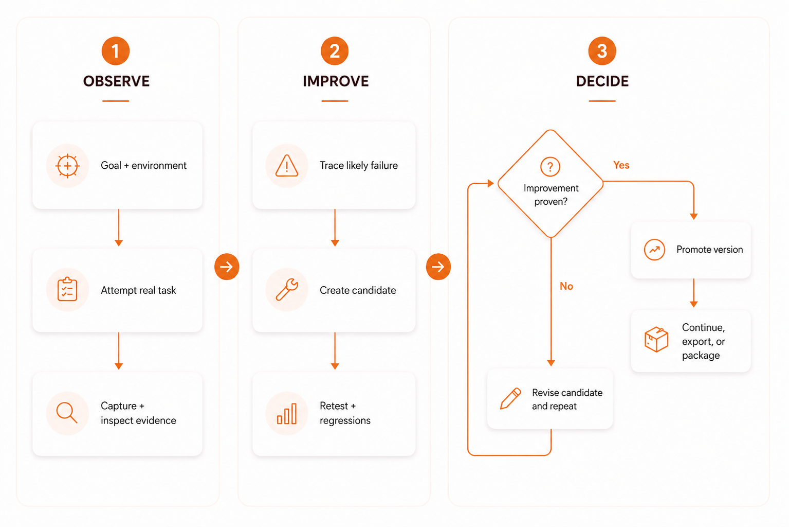

# Harneloop

Harneloop is an open-source, agent-first framework for building and evolving task-specific AI agent harnesses through artifact-aware testing, trace-backed diagnosis, and evidence-gated promotion.

The agent attempts a real task, captures the resulting artifacts, logs, traces, and state, compares the result with the desired outcome, and traces likely mistakes back through the recorded run. It can then propose a candidate change to its instructions, context, tools, retrieval, validators, or environment and test again. The working harness stays unchanged until evidence shows that the candidate improves the target without unacceptable regressions.

## Lifecycle At A Glance



Each task-specific development environment is a portable **harness unit** containing its goal, environment map, harness material, experiments, evidence, regression cases, and restorable versions. Agents can reason freely and add what they need inside candidate workspaces; Harneloop structures the lifecycle and protects promotion rather than forcing every task through a fixed script. Units can be paused, moved, continued by another compatible agent or machine, and exported into their target environment.

Setup is agent-first: give a capable agent the repository link and describe what you want to improve. It can install Harneloop, onboard itself, inspect or build the testing environment, and create the first harness unit, asking only when important context or permission is missing. A guided manual setup and full CLI are also available.

> Harneloop is not another agent runtime or evaluation dashboard. It is the artifact-aware development and versioning layer an agent uses to build a better harness without replacing the working version before an improvement is proven.

**Project status:** [v0.0.2 public alpha](https://github.com/Ker102/Harneloop/releases/tag/v0.0.2). The core lifecycle works, but commands and file formats may still change before a stable release.

**Contributions are welcome.** Early users can help by testing Harneloop on new task families, reporting failures, improving agent integrations, or contributing focused lifecycle and documentation changes. See [Contributing](#contributing).

## Evidence From A Real Case Study

Harneloop was used to develop the custom ViperMesh harness unit for Blender spatial-reasoning and scene-construction tasks. The comparison kept the acting model fixed at **GPT-5.5 High** and tested the evolved ViperMesh harness against the **Anthropic x Blender MCP server baseline**, isolating the harness as the main changed system layer.

- ViperMesh was faster on **6 of 7** comparable live tasks, with a **2.534x mean speedup**.
- Preliminary neutral LLM visual evaluation improved by **8.19 points** across seven live render pairs.
- Local acting-agent token usage was **90.91% lower** on the documented comparable token pair.

Harneloop did not generate the scenes itself. It structured the evidence and artifact loop that exposed weaknesses, guided tool and harness development, and verified whether those changes improved the benchmark. Read the methodology, limitations, and complete results in the [ViperMesh case study](https://www.kristoferjussmann.me/case-studies/vipermesh).

These results provide direct empirical evidence that Harneloop's process works in a real, artifact-heavy agent environment: the acting model stayed the same while the evolved harness produced measurable gains in speed, visual performance, and token efficiency.

## Start Here

- **Using Harneloop through an agent:** [Agent Quick Start](#agent-quick-start)
- **Installing it yourself:** [Install And Start](#install-and-start)
- **Understanding harness units:** [What Is A Harness Unit?](#what-is-a-harness-unit)
- **Understanding the loop:** [The Lifecycle, Made Simple](#the-lifecycle-made-simple)
- **Measured proof:** [ViperMesh case study](https://www.kristoferjussmann.me/case-studies/vipermesh)
- **Connecting a real environment:** [Environment Setup](#environment-setup)
- **Changing defaults:** [Configuration](#configuration)
- **Technical architecture:** [Core lifecycle](docs/architecture/core-lifecycle.md), [runtime layers](docs/architecture/runtime-layers.md), and [concurrency](docs/architecture/concurrency.md)
- **Full agent instructions:** [Agent onboarding](docs/agent-onboarding.md)
- **Visual process:** [Lifecycle at a glance](#lifecycle-at-a-glance), [editable compact diagram](docs/framework-process-compact.md), and [detailed framework diagram](docs/framework-process.md)

## Why Harneloop Exists

Models often repeat the same failures because the useful lessons from one attempt never become a tested part of their working environment. Adding a larger prompt or collecting an evaluation score does not solve the whole problem.

The model is only one part of an agent's performance. The harness around it determines what context it sees, which tools it can use, how it interacts with the environment, what it remembers, how results are inspected, and whether mistakes become durable improvements. For many task-specific problems, this makes the harness the highest-leverage improvement surface available: it can produce significant gains without retraining the model, and every change remains inspectable, testable, reversible, and portable.

Harneloop makes that work structured and efficient. Instead of accumulating one-off prompt edits, it lets an agent develop multiple independent harness units, test changes through real attempts, preserve evidence and history, and continue or export each successful harness as a coherent package.

Harneloop gives the operating agent a controlled improvement loop:

- work on the real task rather than only a synthetic benchmark;
- capture renders, screenshots, files, traces, logs, structured state, or other artifacts;
- inspect those artifacts visually, structurally, or behaviorally;
- trace weak results back to instructions, tools, context, retrieval, environment, or model limits;
- develop improvements as isolated candidate patches;
- test candidates against new attempts and regression cases;
- promote only changes supported by valid evidence;
- preserve restorable versions and package the resulting harness for reuse.

The agent is free to reason and experiment inside the harness workspace. Harneloop controls the integrity-sensitive boundaries: records, protected state, evidence, promotion, snapshots, rollback, and packaging.

### Why Improve The Harness Before The Weights?

Research across agent interfaces, retrieval, tools, and iterative feedback shows that changing the system around a model can substantially improve task performance without changing the model's weights. In task settings where context, retrieval, tools, feedback, or environment interaction are the main bottlenecks, harness-level methods can outperform fine-tuning, sometimes substantially, while preserving the underlying model's general capabilities. Harneloop grew from practical problems encountered while building agent harnesses; the following work independently supports its harness-first direction:

- [Self-Harness](https://arxiv.org/abs/2606.09498) found that agents could mine weaknesses from execution traces, propose harness changes, validate them with regression tests, and improve held-out pass rates across three model families.
- [SWE-agent](https://arxiv.org/abs/2405.15793) showed that a purpose-built agent-computer interface substantially improved how language models navigated repositories, edited code, and executed tests.
- [Reflexion](https://arxiv.org/abs/2303.11366) improved agents through trial-and-error, linguistic feedback, and episodic memory rather than weight updates.
- [Self-Refine](https://arxiv.org/abs/2303.17651) reported an average absolute improvement of roughly 20 percentage points across seven evaluated tasks using iterative feedback and refinement without additional training.
- [Fine-Tuning or Retrieval?](https://aclanthology.org/2024.emnlp-main.15/) found that RAG consistently outperformed unsupervised fine-tuning on the knowledge-injection tasks it evaluated, including both existing and new knowledge.
- [Does Fine-Tuning LLMs on New Knowledge Encourage Hallucinations?](https://arxiv.org/abs/2405.05904) found that models struggled to acquire new factual knowledge through supervised fine-tuning and became more likely to hallucinate as that new knowledge was learned.

Together with the ViperMesh case study, this supports a practical harness-first strategy: **optimize the harness first, measure the result, and modify model weights only when evidence shows that the harness has reached its useful limit.** Harness changes are faster to inspect, reverse, reuse, and validate, and on applicable tasks can deliver larger gains than weight modification without permanently changing the base model.

This does not establish that a harness will always outperform every possible fine-tuning method. Fine-tuning can still be valuable for behavior, style, latency, specialized representations, or capabilities that cannot be supplied effectively at inference time. A strong harness and a well-chosen fine-tune can also complement each other.

## What Is A Harness Unit?

A **harness unit** is a portable workspace for improving one task family. Each unit develops independently and keeps its own target definition, environment map, harness material, experiments, evidence, regression cases, and promoted versions.

A new unit begins with this structure:

```text
my-harness-unit/
  unit.yaml                 identity and current version
  UNIT_AGENT.md             instructions for agents entering the unit
  operational-map.md        current understanding of tools, artifacts, and workflow
  target/                   task goal and suggested first tests
  environment/              contract for commands, MCP tools, apps, and artifact paths
  agent-facing/             promoted instructions and context
  tools/                    unit-specific helper tools
  observers/                ways to inspect outputs
  validators/               deterministic or agent-driven checks
  regression-cases/         failures that future candidates should not repeat
  candidates/               isolated proposed harness changes
  runtime/                  local runs and captured artifacts
  versions/                 restorable promoted snapshots
  provenance/               human-readable change history
```

This is not a restrictive template. Agents can add research, scripts, retrieval data, infrastructure declarations, memory, custom observers, or entirely new folders. The framework protects only the files and lifecycle rules needed to keep the unit understandable and recoverable.

### Portable Unit Versus Local Working Data

The reusable harness material belongs in the portable unit. Raw traces, temporary experiments, caches, secrets, unpromoted candidates, and every historical render do not.

The default `thin` package contains the promoted knowledge and contracts needed to rebuild or integrate the harness. Runtime evidence remains local unless a future package profile explicitly includes it.

## The Lifecycle, Made Simple

1. **Describe the goal.** The user explains what the agent should become better at.
2. **Map the environment.** The operating agent discovers how the real task is performed and where useful evidence comes from.
3. **Reconcile assumptions.** Important context is confirmed, delegated, or clearly marked as inferred before the first real run.
4. **Run a baseline.** The agent attempts the task before changing the harness.
5. **Inspect and conclude.** It evaluates the artifacts and explicitly accepts, changes, reruns, requests input, or stops.
6. **Create or extend candidates when needed.** Related changes accumulate in coherent isolated batches; independent issues can have parallel candidates.
7. **Validate in proportion to risk.** The agent uses structural, targeted, representative, or full checks and attaches evidence.
8. **Promote, revise, wait, or stop.** Supported improvements become a version. Weak candidates are revised or rejected.
9. **Export or package.** The promoted harness can be applied to a coding agent, application agent, or another compatible environment.

Finished runs are immutable. Candidate evidence is checked when attached and checked again at promotion, so deleted runs, missing artifacts, or missing evidence files cannot support a release.

Candidates are not one-per-commit wrappers. A setup or tooling candidate can collect several related changes and receive a focused smoke test, while a behavior-changing harness candidate may require real artifact attempts and regressions. Target-harness, evaluation, and infrastructure changes can proceed independently. If one is promoted, parallel candidates based on the old version must rebase and produce fresh evidence before they can follow.

The image near the top of this README shows this loop at a glance. The [compact lifecycle document](docs/framework-process-compact.md) contains its editable Mermaid source. See the [detailed process diagram](docs/framework-process.md) for capability gaps, human input, waiting, stopping, and the complete artifact-aware loop.

## What Makes It Different?

### Artifact-aware

Harneloop treats the produced thing as evidence. The agent can inspect an image, scene, UI, document, generated repository, runtime trace, database state, or any other useful output instead of trusting its own textual report.

### Harness-building, not only scoring

The purpose is not merely to report that an agent failed. The operating agent diagnoses the failure and develops a concrete harness change that may include prompts, principles, examples, retrieval, tools, observers, validators, regression cases, or environment automation.

### Evidence-gated self-improvement

The active agent cannot freely rewrite the promoted harness. It creates a candidate, tests it, attaches evidence, and promotes it through the framework. Every promoted version can be inspected and restored.

### Environment-agnostic

The core does not depend on Blender, SVGs, Python agents, or a specific model provider. A unit can use terminal commands, MCP servers, browser automation, desktop apps, APIs, manual steps, or a custom tool interface.

### Reasoning remains open-ended

Harneloop structures the lifecycle without turning the operating agent into a fixed script. The agent still chooses the appropriate tests, artifacts, evaluation strategy, tools, and stopping point for the task.

## Agent Quick Start

Harneloop is designed to be used primarily by talking to an agent with filesystem and terminal access.

Give the agent the repository and a prompt like this:

```text
Read this repository's README.md and docs/agent-onboarding.md.
Use Harneloop to create a harness unit that improves an agent at: [describe the task].

Inspect my existing environment before deciding how to test it. Ask only for context
that can materially change the work, and do not silently treat assumptions as confirmed.
Run a baseline, inspect its artifacts, and conclude the attempt before deciding whether
a candidate is needed. Do not promote a candidate without evidence.
```

The agent should then:

1. Install the Harneloop tool if needed and run `harneloop doctor`.
2. Read `harneloop onboard --format json` or [the onboarding guide](docs/agent-onboarding.md).
3. Create or continue a provisional harness unit and inspect the actual environment.
4. Reconcile confirmed, delegated, inferred, and unknown context through the adaptive intake checkpoint.
5. Update `operational-map.md` with the current understanding.
6. Perform a baseline and inspect the resulting artifacts.
7. Conclude the attempt before accepting the current harness or proposing improvements.

### Instructions For Agents Reading This Repository

If you are the operating agent:

- Do not assume every task has a test command.
- Do not assume Harneloop discovers endpoints, tools, screenshots, or artifact paths for you.
- Run `harneloop brief <unit>` and read `AGENTS.md`, `UNIT_AGENT.md`, and `operational-map.md` when entering a unit or recovering from context loss.
- Apply the unit brief only while working on that harness unit; unrelated project work remains outside its scope.
- Use `harneloop intake status` to surface only unresolved questions that can materially change the work.
- Use `harneloop candidate list <unit>` to recover all open work; do not assume a harness unit can have only one active candidate.
- Batch related changes into coherent candidates and scale validation to impact instead of running a full benchmark after every setup edit.
- Keep evaluator and target-harness changes separate when possible so the evidence remains trustworthy.
- Inspect the real environment and map it into `target/` and `environment/`.
- Prefer real artifact inspection when deterministic checks cannot establish quality.
- Separate your own capabilities from tools being designed for the target agent.
- Optimize for the best verified result rather than rebuilding everything: research and reuse suitable tools, skills, libraries, examples, and prior work while recording provenance and respecting license, security, cost, and permission boundaries.
- Put proposed harness changes in a candidate workspace.
- Use Harneloop commands for runs, artifacts, evidence, promotion, rollback, wait, stop, and resume.
- Ask before adding credentials, paid services, external access, security-sensitive tools, or expensive infrastructure.
- Update the operational map when assumptions, artifact paths, tools, or automation change.
- Never stop at run completion: inspect the artifacts and record an explicit decision with `harneloop attempt conclude`.

Machine-readable onboarding is available through:

```bash
harneloop onboard --format json
```

## Install And Start

Harneloop currently installs from GitHub as an isolated, user-level tool through [uv](https://docs.astral.sh/uv/getting-started/installation/). The resulting `harneloop` command works from any directory on Windows, macOS, and Linux.

```bash
uv tool install git+https://github.com/Ker102/Harneloop.git
harneloop doctor
harneloop setup
```

If `uv` reports that its tool directory is not on `PATH`, run `uv tool update-shell` and open a new terminal. Contributors working from a clone can install the live checkout with `uv tool install --editable .`; see [development setup](docs/development.md).

`harneloop setup` opens the guided human-facing CLI. Running `harneloop` without a command opens the broader interactive menu in a terminal. Agents can use the explicit non-interactive commands directly.

Useful first commands:

```bash
harneloop onboard
harneloop template list
harneloop units list
harneloop settings show
```

Harness units created by `harneloop setup` or `harneloop init-unit` are registered automatically. Existing units can be added once with:

```bash
harneloop units register /path/to/my-unit
```

After registration, use the unit ID or name from any directory instead of a relative path:

```bash
harneloop units list
harneloop status my-unit --format markdown
harneloop environment status my-unit
```

## What The Agent Asks You

New-unit onboarding is intentionally short. The agent should collect five pieces of context:

1. What should this harness help an agent become better at?
2. Where will the harness be used?
3. Should you define success, should the agent propose it, or should it be decided after a baseline?
4. Should validation prioritize quality, visual evidence, balance, or resource efficiency?
5. Does a testing environment already exist, partly exist, or need to be built?

You do not need to know the perfect tests or artifacts in advance. When appropriate, the agent should propose them after inspecting the task and environment. It may ask about constraints, protected areas, cost limits, or human review only when those details matter.

## Environment Setup

Harneloop records an environment mapping; the operating agent creates that mapping.

The CLI cannot magically know which MCP tool controls an application, where a render is saved, how a browser flow is reset, or what database state proves success. The agent must inspect the real workspace and connect those details to the harness unit.

Three setup modes are supported:

| Mode | Use it when | Agent behavior |
|---|---|---|
| `existing` | The task environment already works | Connect and document it; do not rebuild it without reason |
| `assisted` | Some pieces exist | Identify and add the smallest missing setup needed for a baseline |
| `managed` | The environment must be created | Build it explicitly and document infrastructure changes |

An environment can be command-driven, MCP-driven, manual, or fully custom. For example, a Blender harness may use an existing MCP server with no single run command. The agent can call tools, render the scene, capture screenshots and structured scene state, then attach those outputs to a Harneloop run.

Read [environment onboarding](docs/environment-onboarding.md) for detailed examples.

## Configuration

Most users should begin with the defaults. The first useful configuration is usually inside the harness unit, not in global settings.

### Harness-unit Configuration

| File or area | Change it when |
|---|---|
| `operational-map.md` | Tools, artifact locations, assumptions, constraints, or the workflow changes |
| `target/brief.yaml` | The task family, success definition, expected artifacts, or known risks change |
| `environment/contract.yaml` | Commands, MCP tools, setup mode, interaction mode, or output paths change |
| `agent-facing/` | A tested candidate promotes new instructions or reusable context |
| `observers/` and `validators/` | The unit needs better artifact inspection or deterministic checks |
| `regression-cases/` | A discovered failure should be tested in future iterations |
| `tools/` and `infrastructure/` | Better performance requires unit-specific capabilities or services |

Do not manually edit framework-owned `.evolve/`, `versions/`, `provenance/`, `runtime/`, or candidate metadata. Use the CLI lifecycle commands.

### Global Preferences

View preferences with `harneloop settings show` and change one with:

```bash
harneloop settings set validation.prefer_visual_artifacts true
harneloop settings set agent_behavior.autonomy_level balanced
harneloop settings set runtime.token_efficiency_mode false
```

Important preference groups are:

- `agent_behavior`: autonomy, risky-action confirmation, and promotion strictness;
- `validation`: agent-decided validation, visual-artifact preference, and resource mode;
- `export`: default target adapter and package profile;
- `runtime`: telemetry detail, token-efficiency mode, and local unit registry behavior.

In the alpha, preferences are durable defaults and guidance for the CLI and operating agent. Not every preference is enforced automatically by every engine command yet. Evidence-required promotion is enforced unless the explicit development override is used.

## Example Use Cases

- Improve spatial reasoning and scene construction for a Blender or CAD agent.
- Improve SVG, image, slide, document, or UI generation through rendered artifact review.
- Build a coding-agent harness for a repository with recurring implementation or debugging failures.
- Improve browser automation using screenshots, DOM state, traces, and task outcomes.
- Develop better tool selection and recovery behavior for an MCP-based agent.
- Evolve retrieval, examples, validators, and context for a research or data-processing workflow.
- Build a reusable internal harness, then export it for Codex, Cursor, or a custom application agent.

Harneloop is most useful when the task is repeated, outputs can be inspected, and failures can become durable improvements. It is unnecessary for a one-off task where no learning will be reused.

## Core CLI Lifecycle

The explicit commands are intended for agents, automation, and technical users:

```bash
harneloop init-unit ./my-unit --id my-unit --name "My Harness Unit" --template artifact-review
harneloop target set my-unit --task "..." --success "..."
harneloop environment connect my-unit --name "..." --mode existing --description "..."
harneloop attempt plan my-unit --goal "..." --method "..."
harneloop run start my-unit --task "Baseline attempt"
harneloop artifact add my-unit run-0001 ./output.png --kind image
harneloop run finish my-unit run-0001 --status succeeded --summary "Baseline captured"
harneloop candidate create my-unit --summary "Improve artifact construction" --plane target_harness --validation-tier representative
harneloop run start my-unit --task "Test candidate improvement" --candidate-id cand-0001
harneloop artifact add my-unit run-0002 ./improved-output.png --kind image
harneloop run finish my-unit run-0002 --status succeeded --summary "Candidate result captured"
harneloop candidate evidence add my-unit cand-0001 --kind artifact_review --summary "..." --run-id run-0002 --artifact-id artifact-0001 --validation-tier representative
harneloop candidate stage my-unit cand-0001 ready
harneloop promote my-unit cand-0001 --version 0.1.0
harneloop export my-unit --adapter codex
harneloop package my-unit --output ./my-unit-0.1.0.tar.gz
```

This sequence is illustrative, not a fixed recipe. Tool-driven agents may perform many actions between `run start` and `run finish`, capture several artifacts, create multiple attempts, or wait for external results.

## Safety And Integrity

- YAML and JSON control files are written atomically.
- Concurrent ID allocation and read-modify-write operations use harness-local locks.
- Finished runs cannot be changed or finished again.
- Candidate overlays cannot modify protected framework state.
- Evidence references must exist when attached and at promotion time.
- Candidate evidence must match the candidate's current base version and declared validation tier.
- Parallel candidates survive another promotion but must rebase and collect fresh evidence before promotion.
- Promoted versions are stored as restorable snapshots.
- Rollback is a recorded framework action.
- Thin packages exclude runtime data, candidates, caches, and common secret files.

## Documentation

- [How Harneloop works](docs/framework-process.md)
- [Agent onboarding](docs/agent-onboarding.md)
- [Environment onboarding](docs/environment-onboarding.md)
- [Core lifecycle](docs/architecture/core-lifecycle.md)
- [Runtime layers and future Rust boundary](docs/architecture/runtime-layers.md)
- [Concurrency and file safety](docs/architecture/concurrency.md)
- [Product principles](docs/product-principles.md)
- [Local demo](docs/demo-first-test.md)
- [Development notes](docs/development.md)

## Contributing

Contributions, issue reports, and independent harness-unit case studies are welcome. Particularly useful contributions include:

- testing Harneloop on task families beyond the existing case study;
- reporting reproducible lifecycle, portability, or agent-onboarding failures;
- improving target-agent adapters, validators, packaging, and cross-platform behavior;
- contributing focused documentation, examples, or regression coverage.

Read [CONTRIBUTING.md](CONTRIBUTING.md) before substantial changes. Open an issue first for architectural work so its scope and compatibility impact can be discussed. Security issues should follow [SECURITY.md](SECURITY.md) rather than a public issue.

## Development

Run the test suite from the repository:

```bash
python -m unittest discover -s tests
```

The project currently uses Python 3.11 or newer. A future Rust runtime may own stronger protected lifecycle, packaging, file-watching, or desktop-distribution responsibilities after the product surface stabilizes.

Harneloop is the selected product identity for the alpha and public-launch path. The package, CLI, harness-unit metadata, documentation, and repository use the same name.

## License

Harneloop is available under the [Apache License 2.0](LICENSE).
