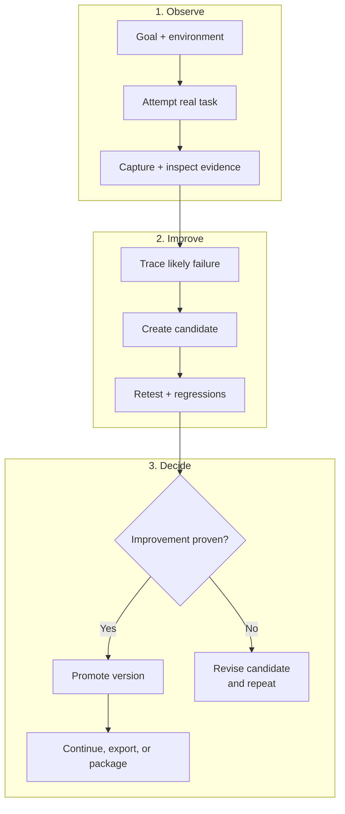

# Harneloop Lifecycle - Compact

This version keeps only the core evidence-backed harness evolution loop. Its three stacked rows are intended to stay readable in GitHub Markdown and translate cleanly into a roughly 4:3 graphic.

The promoted harness remains unchanged until the evidence gate confirms an improvement. A rejected candidate returns to diagnosis and revision without replacing the current version.

See [How Harneloop Works](framework-process.md) for the full architecture diagram.

The raw Mermaid source is available at [`docs/diagrams/framework-process-compact.mmd`](diagrams/framework-process-compact.mmd).
