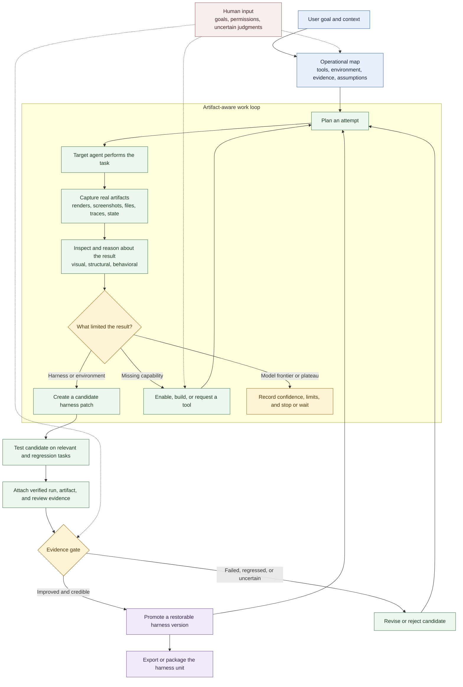

# How Harneloop Works

Harneloop gives an operating agent a persistent, evidence-gated loop for improving the harness around a target agent. The operating agent still chooses how to work: Harneloop records the evolving environment, artifacts, candidate changes, and promotion history without reducing the process to a fixed test script.

For a smaller three-stage version suitable for README placement or a roughly 4:3 graphic, see the [compact lifecycle](framework-process-compact.md).

## The Three Roles

**The operating agent** discovers the real environment, chooses tests, uses or adds capabilities, inspects artifacts, diagnoses failures, and proposes candidate harness changes.

**The harness unit** carries the reusable instructions, tools, observers, validators, examples, infrastructure declarations, operational map, candidates, and promoted versions for one task family.

**The Harneloop engine** owns lifecycle integrity: atomic records, immutable finished runs, protected framework state, validated evidence references, candidate promotion, snapshots, rollback, packaging, and exports.

## What Evolves

A candidate can change more than a prompt. It may add or revise tools, retrieval data, examples, agent instructions, validators, observers, research, infrastructure declarations, or environment automation. Promotion turns the successful candidate into a restorable harness version; unsuccessful experiments remain outside the promoted unit.

## What The Diagram Leaves Open

The exact task execution and evaluation strategy are deliberately unit-specific. A Blender unit may use an MCP server and inspect renders or scene state. An SVG unit may render outputs in a browser and compare visual and structural evidence. Harneloop supplies the process and integrity boundaries; the operating agent maps each real environment into them.
